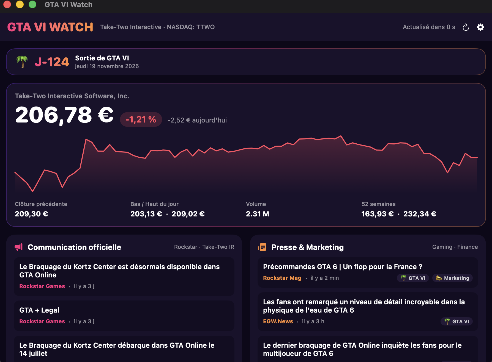

# GTA VI Watch 🌴 — GTA 6 & Take-Two (TTWO) tracker for macOS

    

**The all-in-one GTA 6 dashboard for your Mac.** A native macOS menu bar app that tracks everything around **Grand Theft Auto VI** and **Take-Two Interactive (NASDAQ: TTWO)**: live stock price, official Rockstar Games & Take-Two announcements, gaming & finance press coverage, native alerts, and a countdown to the GTA VI release date.

Built with SwiftUI. **Zero dependencies, no API keys, ~1.3 MB, sandboxed.** French 🇫🇷 / English 🇺🇸 interface. Made by **[Torjant](https://github.com/T0rjant)**.

> 🇫🇷 **Version française plus bas** [cliquer ici](#-version-française)



<p align="center"><sub>Dashboard live stock, GTA VI countdown, official & press feeds · <a href="docs/screenshot-settings.png">Settings screenshot</a></sub></p>

## Features

- 📊 **Live TTWO stock** price, day change, chart over **1D · 5D · 1M · 6M · 1Y**, volume, 52-week range, next earnings date, **USD or EUR** (real-time exchange rate)
- 🌅 **Full trading day awareness** pre-market & after-hours quotes, and a status badge that knows the four NASDAQ sessions (pre / open / after hours / closed, with next opening time in your timezone)
- 💼 **My position** enter your shares & average buy price → live value and gain/loss, stored only on your Mac
- 🖥️ **Menu bar ticker** TTWO price always visible next to your clock; click for a quick summary popover
- 📢 **Official communication** Take-Two Investor Relations press releases + Rockstar Games Newswire + official YouTube channel
- 📰 **Press & marketing coverage** gaming and finance articles **with real 2–4 line summaries**, auto-tagged (🎬 Trailer, 💹 Finance, 📣 Marketing, 📅 Release)
- 🐦 **X insiders column** follow the accounts that break GTA VI news first (videotech, Tex2, Tom Henderson, Chris Klippel by default — fully configurable)
- 🎬 **Official GTA VI trailers** thumbnail gallery, new trailers auto-detected from Rockstar's official channel only
- 📖 **Expandable article cards** click any headline to unfold an animated panel with the summary, full date, and a *Read article* button — plus unread dots so you spot what's new
- 🔔 **Clickable native alerts** official announcements, daily stock moves, **custom price thresholds** (alert above/below your own levels), optional insider posts — click a notification to open the article
- 🚀 **One-click updates** the app checks this repo's Releases and installs new versions by itself
- 🌴 **GTA VI release countdown** days left until launch, editable if Rockstar shifts the date
- 🌍 **Bilingual** switch French/English: UI *and* news sources follow
- ⚡ **Launch at login**, closes to the menu bar, ~0 % CPU when idle

## Install

**Requirements**: Apple Silicon Mac (M1, M2, M3, M4 or newer), macOS 14 or later.

1. **Download** the `.pkg` file from the latest [Release](../../releases).
2. **Open it.** Because the app isn't notarized by Apple (I don't have a paid Developer account), macOS Gatekeeper will block it the first time with a message like *"Apple could not verify this app is free of malware."* This is expected here's how to get past it:
    **Right-click** the `.pkg` → **Open** → in the dialog, click **Open** again. *(Or: double-click, let it fail, then go to  **System Settings → Privacy & Security**, scroll down, and click **"Open Anyway"**.)*
3. Follow the installer the app is placed in your **Applications** folder.
4. **Launch it** from Applications. macOS may show the same warning once more for the app itself → **right-click → Open** again. After that, it opens normally forever.
5. The app lives in your **menu bar** (top of the screen, next to the clock). Click its icon anytime; **"Open dashboard"** shows the full window.

> 🔒 Why the warning? It's just Gatekeeper being cautious with apps not signed by a paid Apple account — **not** a sign the app is unsafe. The full source code is right here in this repo, so you can verify there's nothing hidden. Only install it because you trust the source.

**Optional launch at login:** open the app's **Settings (⚙️)** and toggle *Launch at login* so it watches for you automatically every time you start your Mac.

Prefer zero warnings? **Build it yourself in 30 seconds** (see below) compiled on your own machine, macOS trusts it with no prompt.

## Build from source

```bash
git clone https://github.com/T0rjant/gta6-watch.git && cd gta6-watch
./build.sh
```

Only needs Apple's Command Line Tools (`xcode-select --install`) — no Xcode. The script outputs both the `.app` and the `.pkg` in `build/`.

## Data sources

| Data | Source | Default refresh |
|---|---|---|
| TTWO stock & EUR/USD | Yahoo Finance (~15 min delayed) | 5 min (1 h when NASDAQ is closed) |
| Official news | Take-Two IR RSS + BusinessWire + Rockstar (Google News) | 30 min |
| Press | Google News (GTA 6 / Take-Two / Rockstar query) | 30 min |

No API keys, no account, no server.

## Security & privacy

- **App Sandbox** outbound network connections only; no access to your files, mic, or camera; nothing listens for incoming connections
- **Hardened Runtime** + strict **App Transport Security** (HTTPS only)
- **Link filtering** only `http(s)` links from feeds can open, in your default browser
- **Zero data collected** no telemetry, no analytics, no account; the only traffic is read-only requests to the three public sources above

## Code architecture

```
Sources/
├── App.swift       — entry point, scenes (window + menu bar)
├── Models.swift    — domain types + Yahoo Finance decoding
├── L10n.swift      — FR/EN strings + localized formatting
├── Fetchers.swift  — networking (Yahoo, RSS) + dependency-free RSS parser
├── Store.swift     — observable state, timers, alert logic
├── Notifier.swift  — macOS notifications
└── Views.swift     — SwiftUI (dashboard, popover, settings)
```

---

# 🇫🇷 Version française

**Le dashboard GTA 6 tout-en-un pour Mac.** App native (SwiftUI) de veille **Grand Theft Auto VI** et **Take-Two Interactive (NASDAQ : TTWO)** : bourse en direct, annonces officielles Rockstar / Take-Two, presse gaming & finance, alertes natives, compte à rebours de la sortie.

## Fonctionnalités

- 📊 **Bourse TTWO en direct** cours, variation, graphique sur **1J · 5J · 1M · 6M · 1A**, volume, 52 semaines, prochains résultats, **USD ou EUR** (taux de change en temps réel)
- 🌅 **Journée boursière complète** cotations avant-Bourse et après-Bourse, badge qui connaît les 4 sessions du NASDAQ (avant-Bourse / ouvert / après-Bourse / fermé, avec l'heure d'ouverture dans ton fuseau)
- 💼 **Ma position** saisis tes actions et ton prix d'achat moyen → valeur en direct et gains/pertes, stocké uniquement sur ton Mac
- 🖥️ **Ticker barre de menus** le cours TTWO toujours visible à côté de l'heure ; un clic ouvre le résumé
- 📢 **Communication officielle** communiqués Take-Two IR + Rockstar Newswire + chaîne YouTube officielle
- 📰 **Presse & marketing** articles gaming/finance **avec de vrais résumés de 2-4 lignes**, auto-étiquetés (🎬 Trailer, 💹 Finance, 📣 Marketing, 📅 Sortie)
- 🐦 **Colonne Insiders X** les comptes qui sortent les infos GTA VI en premier (videotech, Tex2, Tom Henderson, Chris Klippel par défaut — entièrement configurable)
- 🎬 **Trailers officiels GTA VI** galerie de miniatures, nouveaux trailers détectés automatiquement depuis la chaîne officielle Rockstar uniquement
- 📖 **Cartes d'articles dépliables** clique sur un titre pour déplier un panneau animé avec le résumé, la date complète et un bouton *Lire l'article* — avec pastilles non-lu pour repérer les nouveautés
- 🔔 **Alertes natives cliquables** annonces officielles, mouvements du jour, **seuils de prix personnalisés** (alerte au-dessus/en dessous de tes niveaux), posts insiders en option — un clic sur la notification ouvre l'article
- 🚀 **Mise à jour en 1 clic** l'app surveille les Releases de ce dépôt et installe les nouvelles versions toute seule
- 🌴 **Compte à rebours GTA VI** date modifiable si Rockstar re-décale
- 🌍 **Bilingue** le français/anglais bascule l'interface **et** les sources d'actus
- ⚡ **Lancement au démarrage**, vit dans la barre de menus, ~0 % CPU au repos

## Installation

**Prérequis** : Mac Apple Silicon (M1, M2, M3, M4 ou plus récent), macOS 14 ou plus.

1. **Télécharge** le fichier `.pkg` depuis la dernière [Release](../../releases).
2. **Ouvre-le.** Comme l'app n'est pas notariée par Apple (je n'ai pas de compte développeur payant), macOS va la bloquer la première fois avec un message du type *« Apple ne peut pas vérifier que cette app ne contient pas de logiciel malveillant »*. C'est normal voici comment passer :
    **Clic droit** sur le `.pkg` → **Ouvrir** → dans la fenêtre, clique **Ouvrir** à nouveau. *(Ou : double-clic, laisse échouer, puis va dans **Réglages Système → Confidentialité et sécurité**, descends en bas, et clique **« Ouvrir quand même »**.)*
3. Suis l'installateur : l'app est placée dans ton dossier **Applications**.
4. **Lance-la** depuis Applications. macOS peut réafficher le même avertissement une fois pour l'app elle-même → **clic droit → Ouvrir** encore. Ensuite elle s'ouvre normalement pour toujours.
5. L'app vit dans ta **barre de menus** (en haut de l'écran, à côté de l'heure). Clique son icône quand tu veux ; **« Ouvrir le dashboard »** affiche la fenêtre complète.

> 🔒 Pourquoi l'avertissement ? C'est juste Gatekeeper, prudent avec les apps non signées par un compte Apple payant **pas** un signe que l'app est dangereuse. Tout le code source est ici dans ce dépôt : tu peux vérifier qu'il n'y a rien de caché. Ne l'installe que si tu fais confiance à la source.

**Option lancer au démarrage :** ouvre les **Réglages (⚙️)** de l'app et active *Lancer au démarrage du Mac* pour qu'elle veille automatiquement à chaque démarrage.

Alternative sans aucun avertissement : compiler soi-même (30 secondes, section *Build from source* ci-dessus) compilé sur ta machine, macOS lui fait confiance sans rien demander.

## Sécurité

App Sandbox (réseau sortant uniquement), Hardened Runtime, HTTPS strict, filtre de liens, **zéro donnée collectée** pas de télémétrie, pas de compte, pas de serveur.

---

## License / Licence

Licensed under the **[GNU AGPL v3](LICENSE)** — © 2026 **Torjant**

**🇬🇧 What this means:** you are free to use, study, share, and modify this app for free. But if you redistribute it or run a modified version as a network service, you **must** publish your full source code under the same AGPL license. In practice: **nobody can turn this into a closed, paid product.** For a commercial license (closed-source use), contact the author.

**🇫🇷 Ce que ça implique :** tu es libre d'utiliser, étudier, partager et modifier cette app gratuitement. Mais si tu la redistribues ou l'exploites en service en ligne, tu **dois** publier tout ton code source sous cette même licence AGPL. Concrètement : **personne ne peut en faire un produit fermé et payant.** Pour un usage commercial fermé, contacter l'auteur.
